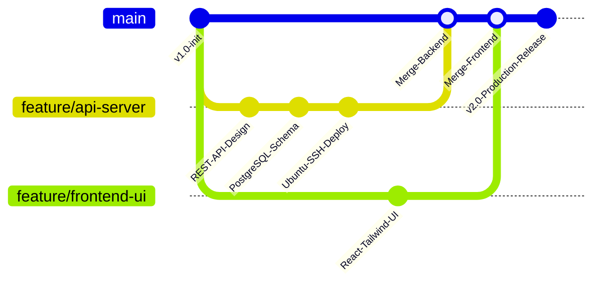

<h1 align="center">Hi 👋, I'm Jeslin J. P.</h1>
<h3 align="center">Full Stack Developer | Software Engineer | Freelancer</h3>

  

  
  
  
  
  

  

---

## 👨‍💻 About Me

I am a **Full Stack Developer and Software Engineer** with practical experience in building responsive web applications, mobile applications, database-driven systems, and real-world client projects. As an active **freelancer**, I specialize in taking projects from initial requirements and UI/UX design all the way through backend integration, database implementation, testing, and deployment.

I possess high-level proficiency in designing **RESTful APIs** and managing **Ubuntu backend servers via SSH**.

- 🔭 **Currently working on:** Freelance full-stack projects, custom API development, and scalable web architectures.
- 🎓 **Education:** Pursuing a B.Tech in Computer Science and Engineering at Karunya Institute of Technology and Sciences (2025 – 2029).
- 🎥 **Content Creator:** Founder and creator behind the programming YouTube channel **[code for programming](https://www.youtube.com/@Jeslin_14)**.
- 🌱 **Core Stack:** Java, Python, C, C++, React, TypeScript, Tailwind CSS, PostgreSQL, MongoDB, Ubuntu, SSH, and Git.
- 💬 **Ask me about:** End-to-end application development, backend server setups, API integration, and freelance collaborations.
- ⚡ **Fun fact:** I take projects from a blank requirements doc all the way to a live SSH-deployed server.

---

## 🛠️ Technical Arsenal

### Languages

  
  
  
  

### Frontend, Backend & APIs

  
  
  
  

### Databases, Servers & Deployment

  
  
  
  
  

---

## 💼 Experience & Freelance Work

* **Freelance Full Stack Engineer** *(Ongoing)* — Delivering custom web and mobile solutions, building efficient API architectures, managing database implementations, and deploying applications for clients.
* **Java Full Stack Developer Intern** @ CCS Info Tech *(May 2026)* — Gained practical experience in Java full stack application development, frontend and backend integration, and professional software engineering practices.
* **Mobile Application Developer Intern** @ CodSoft *(Feb 2026 – Mar 2026)* — Developed mobile application components, implemented core application functionalities, and optimized UI performance.

---

## 🚀 Featured Projects

* **ARK Kitchen (Full Stack Web Application):** Designed and developed a real-world client application with a Python backend and responsive UI/UX frontend interfaces. Managed deployment on Ubuntu using SSH from development to production.
* **ER Hospital Scheduling System:** Developed a database-driven hospital scheduling system with dedicated role-specific workflows for Doctors, Nurses, and Patients using PostgreSQL.
* **Smart India Hackathon (Rural Offline Learning Platform):** Proposed an offline learning platform designed for students with limited or unreliable internet connectivity.
* **Solar Cooker:** Developed a solar cooker prototype using Arduino integrated with programmed control logic.

---

## 📜 Certifications

* Red Hat Linux Certification
* Google Cloud Digital Leader
* Cisco Introduction to Cybersecurity
* Cisco HTML, CSS, JavaScript and Python

---

## 🔀 Git Development Workflow

---

## 📊 Live GitHub Stats & Working Status

  
  

  

  

  

---

  <i>Thanks for stopping by — let's build something scalable together! 🚀</i>

